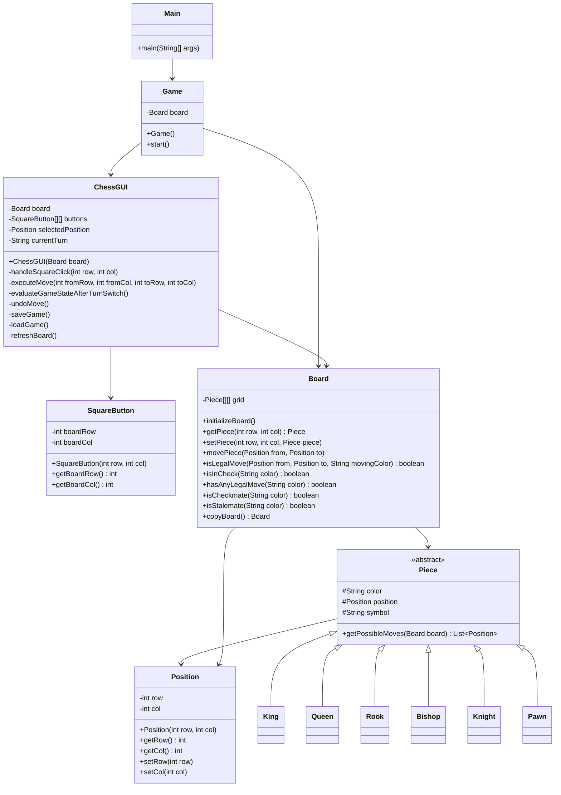

# UML Class Diagram (Phase 3 Integration)

## Notes
- `ChessGUI` is now fully integrated with backend validation via `Board.isLegalMove(...)`.
- `Board` centralizes rule checks for move legality, check, checkmate, and stalemate.
- Piece classes remain responsible for movement patterns, while `Board` enforces king safety.
